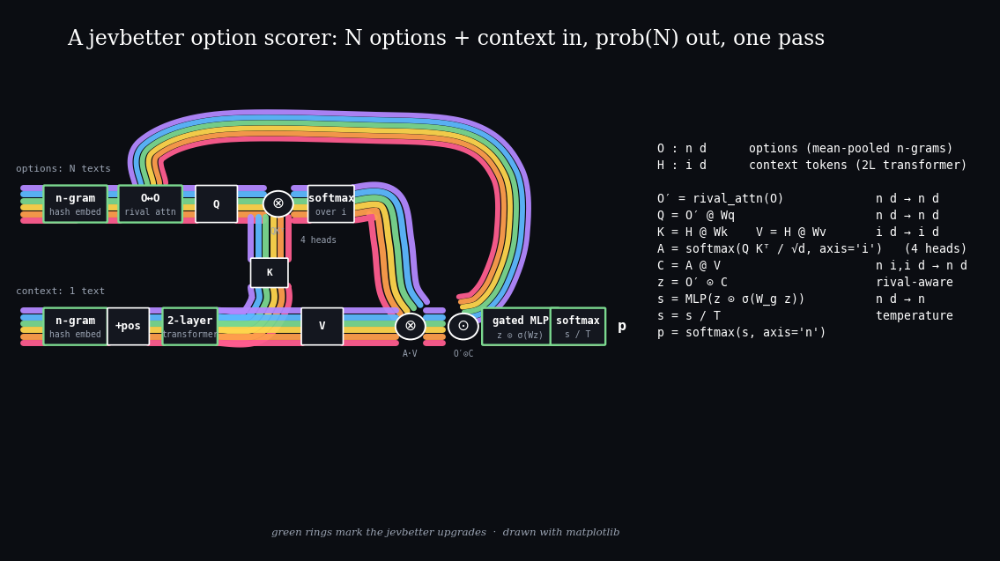
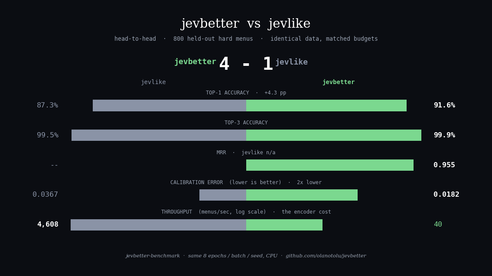

# jevbetter



Train a small model that chooses among a changing list of text options, done **better**.

`jevbetter` is a one-pass option scorer
(type: text in, one probability per option out, single forward pass, no
token-by-token decoding), built from scratch with a stronger encoder, a
rival-aware scoring head, and a sharper training loop. Same JSONL data format
as the open-source [jevlike](https://github.com/vinnylarouge/jevlike) scorer,
so any `jevlike` dataset trains here unchanged, and the benchmark below
compares the two head-to-head on identical data.

> Independent project. Not affiliated with TypeSafe or the Jev model.

## What is it?

A Jev-like model takes a piece of text and a list of `N` text options and returns
one probability per option, in one pass instead of writing an answer word by
word. That makes it a natural fit for routing, ranking, classification with
open label sets, and game controllers.

## jevbetter vs jevlike

| | jevlike | **jevbetter** |
|---|---|---|
| Text encoder | raw byte embeddings (weak on meaning, by their own words) | **hashed character n-grams** (fastText-style subword features, case-insensitive, still CPU-tiny) |
| Context encoding | byte embeddings + positions | **2-layer transformer** over n-gram embeddings |
| Option interaction | none, each option scored alone | **options attend to each other** first, so near-miss rivals sharpen the call |
| Scoring head | single dot product | **gated 2-layer MLP** on the option↔context interaction |
| Training | fixed epochs, flat LR | **cosine schedule + warmup, early stopping, label smoothing** |
| Calibration | raw softmax | **temperature scaling** fit on validation |
| Synthetic data | trivial exact-match menus | **hard mode**: near-miss negatives, distractor sentences, case noise, varied templates |
| Eval | top-1/top-3, ECE | top-1/3/5, **MRR**, ECE, **per-menu-size accuracy**, **throughput**, shuffled control |
| Data input | JSONL | JSONL **+ CSV** (`context,options,label`, options pipe-separated) |

## Head-to-head

`jevbetter-benchmark` trains both models on the *identical* hard synthetic
dataset with matched budgets and prints the comparison:

```
$ jevbetter-benchmark --reference /path/to/jevlike --epochs 8
```

<!--BENCHMARK-->
| model | top-1 | top-3 | MRR | ECE ↓ | menus/sec |
|---|---|---|---|---|---|
| jevlike | 0.873 | 0.995 | n/a | 0.0367 | 4608 |
| jevbetter | 0.916 | 0.999 | 0.955 | 0.0182 | 40 |
<!--/BENCHMARK-->



800 held-out hard menus (2–8 options, near-miss negatives, distractor
sentences), CPU, same 8 epochs / batch size / seed. jevbetter wins on
accuracy (+4.3pp top-1) and calibration (2× lower ECE); the shuffled-context
control scores 0.335 top-1, confirming the model genuinely reads the context.
The transformer context encoder costs throughput: 40 menus/sec is still
orders of magnitude faster than a decoder writing hundreds of tokens, and
`--context-features` tunes the tradeoff.

## Quickstart

```bash
python -m venv .venv && source .venv/bin/activate
pip install -e '.[dev]'

jevbetter-data --output data/synthetic          # hard synthetic menus
jevbetter-train data/synthetic/train.jsonl \
  --validation data/synthetic/validation.jsonl \
  --output runs/model.pt
jevbetter-eval runs/model.pt data/synthetic/test.jsonl
jevbetter-predict runs/model.pt \
  --context "Choose the exact badge amber badger. Badge: amber badger." \
  --option "azure crane" \
  --option "amber badger" \
  --option "gold heron"
```

The evaluation prints top-1/3/5 accuracy, MRR, calibration error, accuracy by
menu size, throughput, and a shuffled-context control (each menu paired with the wrong context, which a useful model beats comfortably).

## Use your own data

JSONL, one object per line (drop-in compatible with `jevlike`):

```json
{"context": "The customer needs a refund.", "options": ["refund", "sales", "technical support"], "label": 0}
```

Or CSV with `context,options,label` columns (options separated by `|`).
`label` is the zero-based index of the correct option; minimum two options per
row, no duplicates.

## Frozen pretrained encoder

Swap the n-gram encoder for a frozen pretrained transformer under the same
rival-aware scoring head:

```bash
pip install -e '.[transformers]'
jevbetter-train data/synthetic/train.jsonl \
  --validation data/synthetic/validation.jsonl \
  --output runs/qwen-head.pt \
  --encoder hf \
  --hf-model Qwen/Qwen2.5-0.5B
```

The checkpoint stores the trained head and the encoder name, not the frozen weights, so loading needs access to the same Hugging Face model.

## Architecture

Each option's text becomes a mean-pooled n-gram vector. Options first attend
to *each other* (rival-aware), then each queries the transformer-encoded
context with multi-head attention. The option↔context interaction passes
through a sigmoid gate into a two-layer MLP that emits one score; a
temperature-scaled softmax over options gives the probabilities.

## Limitations

- This is a research starter, not a copy of any commercial model. We make no
  claim about matching TypeSafe's Jev or its private training method.
- One-pass scoring needs the complete option list before prediction.
- The n-gram encoder is stronger than byte embeddings but still shallow next
  to a pretrained transformer: use `--encoder hf` when meaning matters most.
- Accuracy depends on data quality and split quality, as always.

## Licence

Code is MIT. Pretrained models you download keep their own terms.
